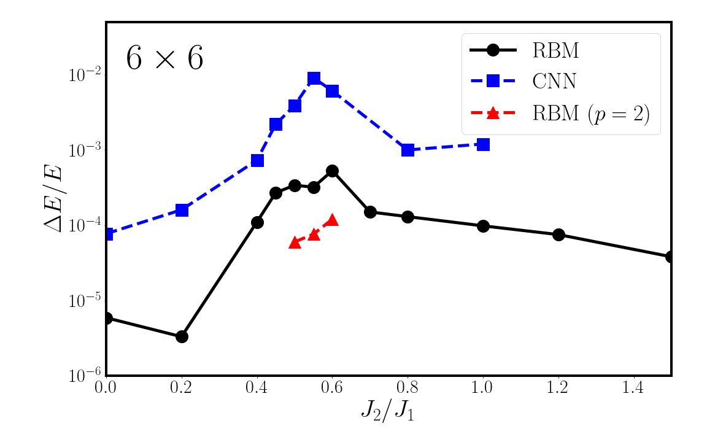
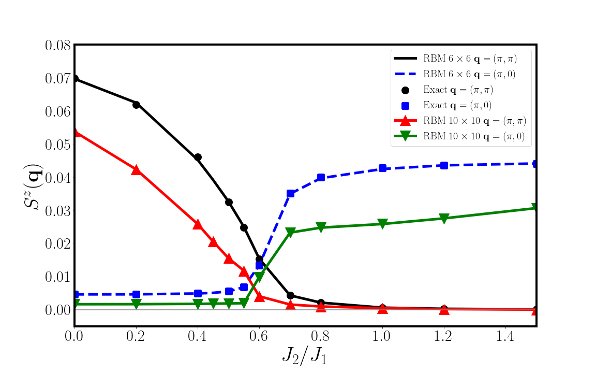

# Systematic improvement of neural network quantum states using Lanczos (NeurIPS 2022)

---

### Introduction
One of the most challenging problems in modern theoretical physics is the so-called quantum many-body problem. Recent applications of machine learning techniques (Neural network quantum state in particular) have been shown to provide highly efficient representations of such complex states, making their overwhelming complexity computationally tractable. Neural Network Quantum States(NNQS) is a general class of variational quantum states parameterized in terms of an artificial neural network to approximate wave functions of many-body quantum systems.

In this work, we propose a symmetry-projected variational ansatz in the form of linear combinations of simple restricted Boltzmann machines(RBM). Besides allowing one to restore spatial symmetries, an expansion in terms of Krylov states using a Lanczos recursion offers a solution that can further improve the quantum state accuracy. We illustrate these ideas with an application to the Heisenberg $J_1 − J_2$ model on the square lattice,  and achieve state-of-the-art accuracy in the representation of the ground state.


This projects requires C++11, OpenMP, Eigen, and Intel MKL. 

### Results

Relative error in the ground state energy of $J_1 − J_2$ model on a $6\times 6$ square lattice with periodic boundary condition. The exact energy is from Lanczos diagonalization [arXiv:cond-mat/9402061](https://arxiv.org/abs/cond-mat/9402061), and the CNN result is from [arXiv:1903.06713](https://arxiv.org/abs/1903.06713). The RBM results (black and red dots) are our work, where $p=2$ means step of Lanczos recursion. 


<!--  -->


Spin structure factor: $$ S(\mathbf{q}) = \frac{1}{N^2} \sum_{i, j} \langle \sigma^z_i \sigma^z_j \rangle e^{i\mathbf{q}\cdot (\mathbf{r_i} - \mathbf{r_j})} $$


<!--  -->

Check our paper for more results and details.


### Reference

arXiv link: https://arxiv.org/abs/2206.14307  
OpenReview: https://openreview.net/pdf?id=qZUHvvtbzy  

If you find this work useful in your research, please consider cite our work:

```
@inproceedings{chen2022systematic,
    title={Systematic improvement of neural network quantum states using Lanczos},
    author={Hongwei Chen and Douglas Gerard Hendry and Phillip E Weinberg and Adrian Feiguin},
    booktitle={Advances in Neural Information Processing Systems},
    editor={Alice H. Oh and Alekh Agarwal and Danielle Belgrave and Kyunghyun Cho},
    year={2022},
    url={https://openreview.net/forum?id=qZUHvvtbzy}
}
```
 
#### Our past work in machine learning for quantum physics:  
Chebyshev expansion of spectral functions using restricted Boltzmann machines  
Paper link: [Phys. Rev. B 104, 205130](https://journals.aps.org/prb/abstract/10.1103/PhysRevB.104.205130) | [arXiv:2103.08804](https://arxiv.org/abs/2103.08804)

Neural network representation for minimally entangled typical thermal states  
Paper link: [Phys. Rev. B 106, 165111](https://journals.aps.org/prb/abstract/10.1103/PhysRevB.106.165111) | [arXiv:2204.11904](https://arxiv.org/abs/2204.11904)